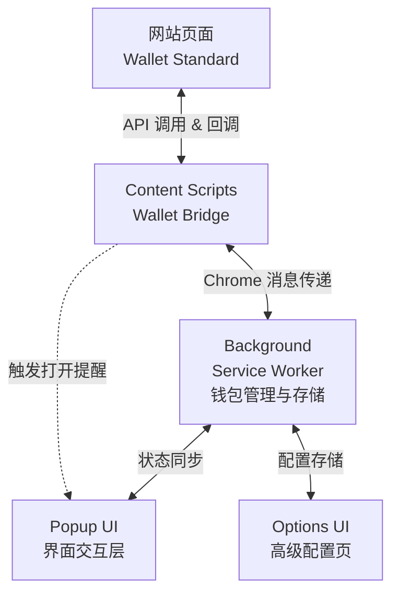
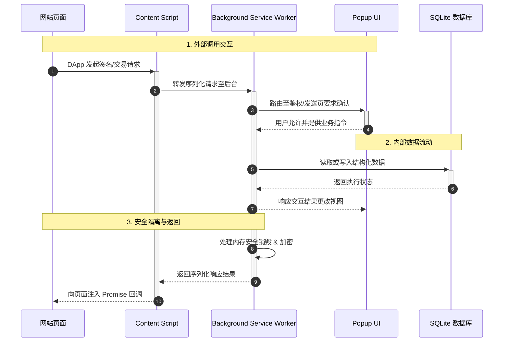

# ZENT Wallet Extension 架构设计文档

## 1. 项目概述

ZENT Wallet Extension 是一个基于 Chrome Extension 的加密货币钱包，采用模块化架构设计，支持 Wallet Standard 协议，提供安全的钱包管理和交易功能。

## 2. 核心架构设计

### 2.1 整体架构图



### 2.2 通信流程

1. **外部调用流程**：网站 → Content Script → Background → UI → 用户确认 → Background → 网站
2. **内部管理流程**：UI → Background（数据请求）→ 数据库操作 → 状态更新 → UI 响应
3. **安全机制防护**：全程数据加密存储保护 → 内存安全销毁管理 → 自动锁定及解锁鉴权策略机制



## 3. 文件目录结构

```text
ZENT-extension/
├── src/
│   ├── background/                 # Service Worker 及核心业务后台
│   │   └── ...                    # 数据管理、钱包鉴权、消息分发机制
│   │
│   ├── content_scripts/            # 页面内容注入脚本
│   │   └── ...                    # Web3 DApp Content 脚本注入 及 DOM 中转桥接
│   │
│   ├── ui/                        # 前端视图展现层
│   │   ├── pages/                 # UI 页面路由和容器
│   │   │   ├── account/           # 账户模块 (解锁、恢复等)
│   │   │   ├── main/              # 应用主界面 (资产视图等)
│   │   │   ├── network/           # 网络配置 (节点与状态)
│   │   │   ├── settings/          # 用户及系统自定义设置
│   │   │   └── wallet/            # 核心操作交互页 (发送、接收、详细信息)
│   │   ├── components/            # 公用复用组件
│   │   └── MainRoute.tsx          # 前端核心路由分发器
│   │
│   ├── shared/                    # 抽象的底层共享模块
│   │   └── ...                    # 工具类算法、类型导出与常量配置
│   │
│   ├── types/                     # 严格类型定义的 Typescript 接口文件
│   │
│   ├── assets/                    # 项目使用的本地静态资源
│   └── manifest.ts                # 具备类型安全支持的扩展动态定义描述文件
│
├── public/                        # 无预处理环境公开调用文件（字体、默认图标等）
├── package.json                   # 描述整个项目全量依赖库
└── vite.config.ts                 # 现代化前端开发构建管线设定
```

## 4. 模块化设计

### 4.1 Background 模块与底层加密驱动

- **Core Wallet 管理中心**: 处理全局的 `private/public key` 保存，统筹协调 `keyring` 工作层进行衍生策略处理。
- **存储与序列化方案**: 通过 `@metamask/obs-store` 及 `browser-passworder` 结合 `crypto-js` 维持内部加密凭据。

### 4.2 UI 前端交互视图

抛弃传统打包方案基于 Webpack ，目前已将整体工程重构为 `Vite 6 + React 19 + Tailwind CSS + Zustand 5`。
UI 的结构进行了深层次切割，分别抽离至 `account, main, network, settings, wallet` 等模块目录，保障各页面能够完全解耦测试、降低状态的维护成本与全局样式污染。

## 5. 安全机制设计

### 5.1 身份认证与锁定拦截

- 设计了一整套安全环境及凭证校验状态管理组件与守卫路由，所有的应用态视图请求前须校验锁定超时标记位。

### 5.2 敏感数据保护机制

- 全程杜绝外部前端持久化私明文数据的现象。所有敏感数据均置于独立及隐形的 `Background Service Worker` 内存沙盒环境运作；UI 层面只向后端发放签名申请并在允许的时候进行交互授权，最大幅度缩减凭证暴露时长及侧信道拦截风险。

## 6. 工具链与工程规范

完全依托最新特性的依赖栈进行模块隔离管理：

- `TypeScript 5.8`: 对绝大部分接口和组件强制落实代码参数及返回检测机制。
- `Tailwind CSS 4.x & daisyUI`: 打造无边框流式的极简跨端式样式控制方案。
- `husky & lint-staged`: 内置基于 Commit 的卡点检测机制，防范格式走形等历史包袱问题。

## 7. 总结

该架构设计在当前演进版本中主要解决了扩展的现代化工程重构痛点：

- ✅ **构建流加速**: Vite 的原生构建提供了相比旧构架飞跃的基础速度。
- ✅ **高安全级别隔离**: 严密的 Background - UI - Content 通讯分层与 Keyring 结合。
- ✅ **直观代码管理**: 更合理的视图 `ui/pages/*` 及业务模块分类手段，降低工程腐化可能。
